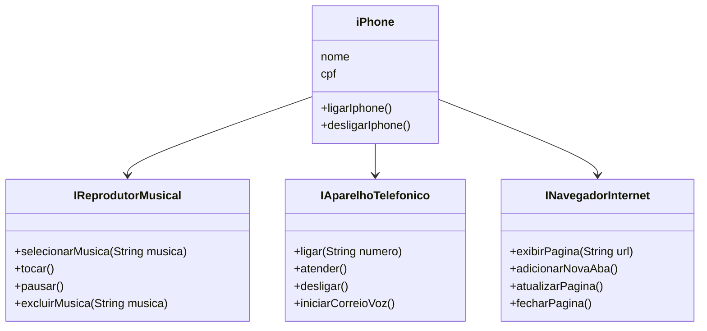

# trilha-java-basico-DIO

## Desafio: Modelagem e Diagramação de um Componente iPhone

Este repositório contém a modelagem UML e a implementação em Java das funcionalidades do iPhone como Reprodutor Musical, Aparelho Telefônico e Navegador na Internet, conforme descrito no desafio.

### Diagrama UML

O diagrama UML foi criado utilizando a sintaxe Mermaid e pode ser visualizado abaixo:




### Implementação em Java

As seguintes interfaces e classe foram implementadas:

- `IReprodutorMusical.java`
- `IAparelhoTelefonico.java`
- `INavegadorInternet.java`
- `iPhone.java`

### Como Executar

Para executar o código, compile todos os arquivos `.java` e execute a classe `iPhone`.

```sh
javac IReprodutorMusical.java IAparelhoTelefonico.java INavegadorInternet.java iPhone.java
java iPhone
```

## Autoria

Implementado por [Lis de Lima Candeia].
